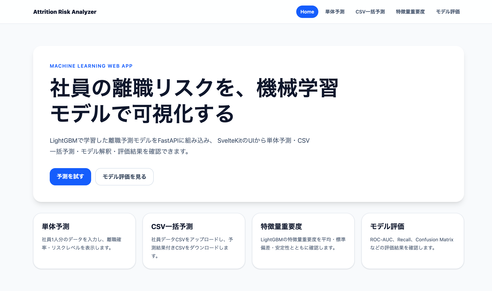
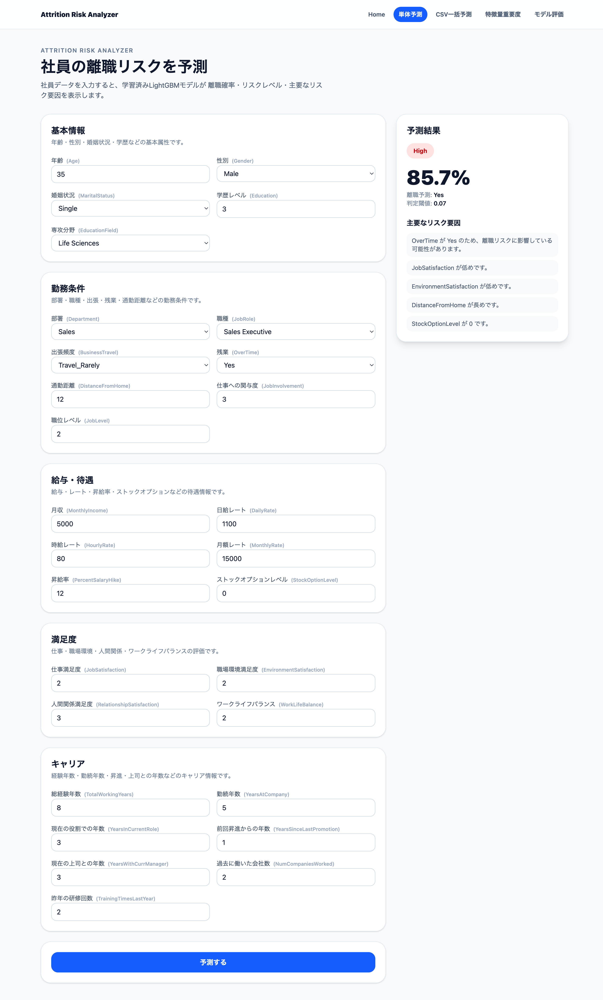
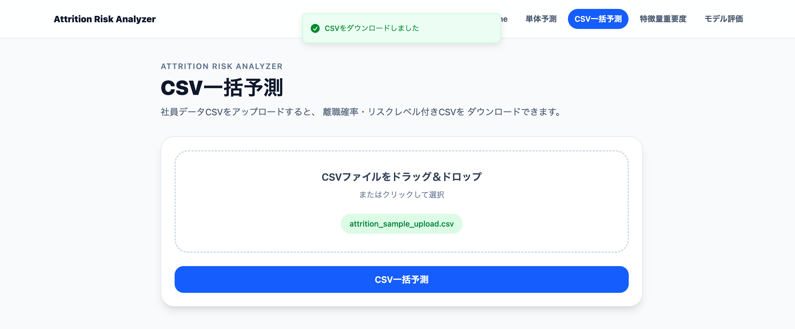
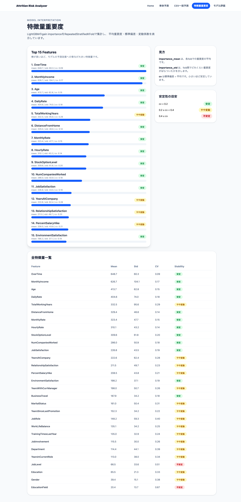
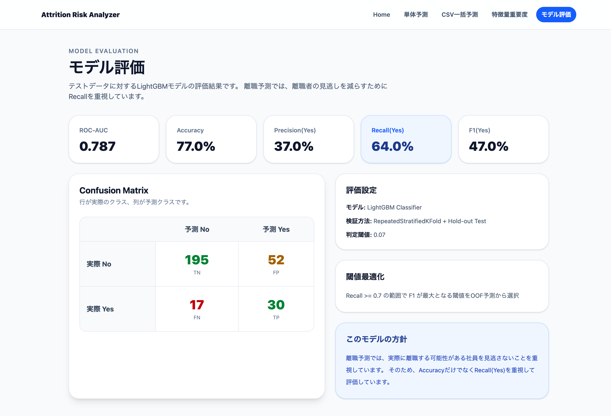

# Attrition Risk Analyzer

社員の離職リスクを機械学習モデルで予測するWebアプリケーションです。

LightGBMで学習した離職予測モデルをFastAPIに組み込み、  
SvelteKitのUIから単体予測・CSV一括予測・モデル解釈・モデル評価を確認できます。

---

## Demo

Frontend (Vercel)

https://attrition-risk-analyzer-kensuke.vercel.app/

Backend API (FastAPI Cloud)

https://attrition-risk-analyzer.fastapicloud.dev/docs

---

## Features

### 単体予測

社員1人分のデータをフォーム入力し、以下を表示します。

- 離職確率
- 離職予測 (Yes / No)
- リスクレベル (High / Middle / Low)
- 主要なリスク要因

---

### CSV一括予測

社員データCSVをアップロードし、

- 離職確率
- 離職予測
- リスクレベル

を追加したCSVをダウンロードできます。

---

### 特徴量重要度

LightGBMのGain Importanceを可視化しています。

以下を表示します。

- importance mean
- importance std
- coefficient of variation (cv)
- 特徴量安定性

---

### モデル評価

テストデータに対するモデル評価を表示します。

- ROC-AUC
- Accuracy
- Precision
- Recall
- F1
- Confusion Matrix

離職予測では、離職者の見逃しを減らすため、Recallを重視した閾値最適化を行っています。

---

## Screenshots

### Home



### Predict



### CSV Prediction



### Feature Importance



### Model Metrics



---

## Machine Learning

### Model

- LightGBM Classifier

### Validation

- RepeatedStratifiedKFold
- Hold-out Test

### Threshold Optimization

OOF予測を用いて、

> Recall ≥ 0.7 を満たす範囲で F1 が最大

となる閾値を採用しました。

### Final Performance

| Metric          | Score |
| --------------- | ----: |
| ROC-AUC         | 0.787 |
| Accuracy        |  0.77 |
| Precision (Yes) |  0.37 |
| Recall (Yes)    |  0.64 |
| F1 (Yes)        |  0.47 |

---

## Tech Stack

### Frontend

- SvelteKit
- Tailwind CSS
- TypeScript
- Vercel

### Backend

- FastAPI
- Pandas
- FastAPI Cloud

### Machine Learning

- LightGBM
- scikit-learn
- NumPy
- Joblib

---

## Project Structure

```text
frontend/
backend/
artifacts/
```

---

## Future Work

- SHAPによる予測理由の可視化
- モデルチューニング
- 認証機能
- 予測履歴管理
- Docker対応

---

## Author

Kensuke Ota
